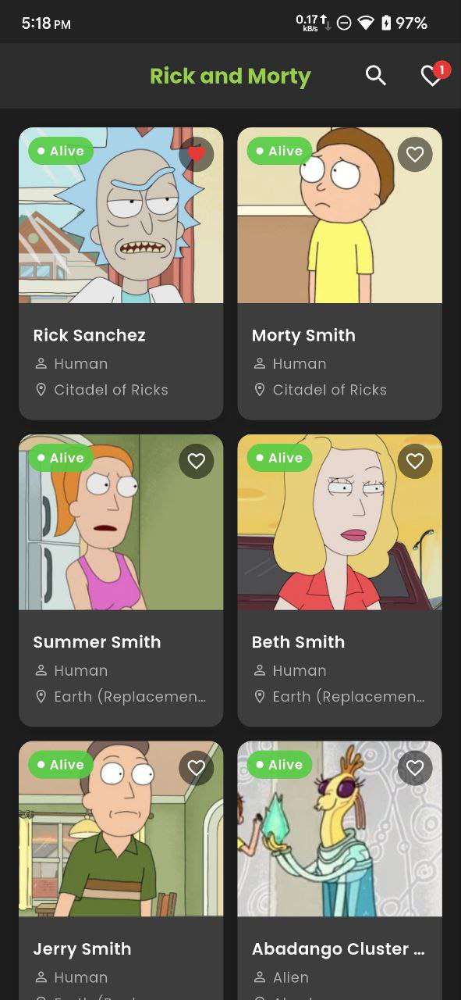
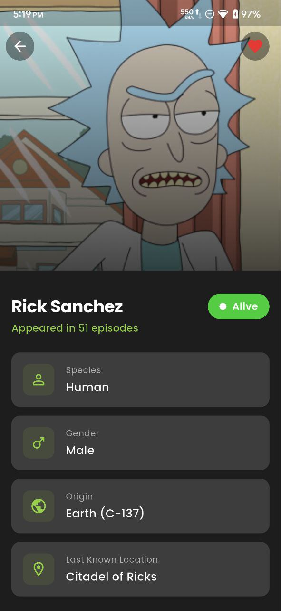
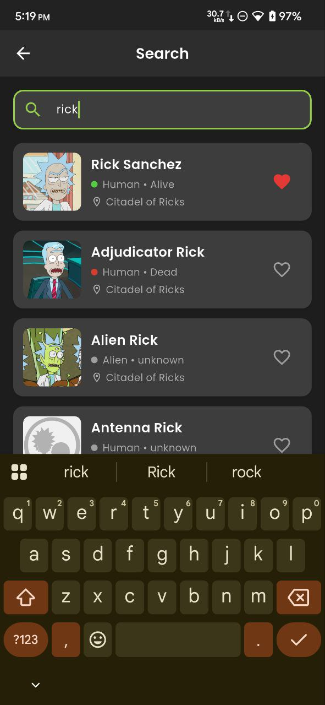
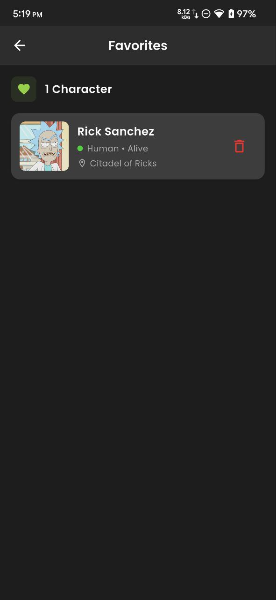

# Rick and Morty App

## <a name="introduction"></a> Introduction :

A Flutter mobile application that displays characters from the Rick and Morty universe. This app is built using **Clean Architecture** principles with **BLoC** as the state management solution. The app fetches data from the [Rick and Morty API](https://rickandmortyapi.com/) and allows users to browse, search, and save their favorite characters.

This project was developed as a take-home challenge submission for BIGIO Mobile Developer position.

## Table of Contents

- [Introduction](#introduction)
- [Features](#features)
- [Screenshots](#screenshots)
- [Libraries](#libraries)
- [Project Structure](#project-structures)
- [Architecture](#architecture)
- [How to Run](#how-to-run)
- [Testing](#testing)
- [APK Link](#apk-link)

## <a name="features"></a> Features :

### Main Features

- **Home Page** - Display list of characters in a responsive grid layout
- **Character Detail** - Show detailed information of a character including:
  - Name
  - Species
  - Gender
  - Origin
  - Last Known Location
  - Status (Alive/Dead/Unknown)
  - Episode count
- **Search Character** - Search characters by name with debounce functionality
- **Favorite Character** - Add/remove characters to favorites stored in local SQLite database
- **Favorite List** - Display list of favorite characters with swipe-to-delete functionality

### Additional Features

- Infinite scroll pagination on Home and Search pages
- Pull-to-refresh functionality
- Shimmer loading animation
- Responsive design for different screen sizes
- Dark theme with Rick and Morty color scheme
- State management for Loading, Loaded, Error, and Empty states
- Unit testing with 22 test cases

## <a name="screenshots"></a> Screenshots :

| Home Page                     | Detail Page                       | Search Page                       | Favorites Page                          |
| ----------------------------- | --------------------------------- | --------------------------------- | --------------------------------------- |
|  |  |  |  |

## <a name="libraries"></a> Libraries :

| Library                                                               | Version | Description                              |
| --------------------------------------------------------------------- | ------- | ---------------------------------------- |
| [flutter_bloc](https://pub.dev/packages/flutter_bloc)                 | ^8.1.3  | State management using BLoC pattern      |
| [equatable](https://pub.dev/packages/equatable)                       | ^2.0.5  | Value equality for Dart objects          |
| [dio](https://pub.dev/packages/dio)                                   | ^5.4.0  | HTTP client for API requests             |
| [sqflite](https://pub.dev/packages/sqflite)                           | ^2.3.0  | SQLite database for local storage        |
| [get_it](https://pub.dev/packages/get_it)                             | ^7.6.4  | Service locator for dependency injection |
| [dartz](https://pub.dev/packages/dartz)                               | ^0.10.1 | Functional programming (Either type)     |
| [cached_network_image](https://pub.dev/packages/cached_network_image) | ^3.3.0  | Image caching and loading                |
| [shimmer](https://pub.dev/packages/shimmer)                           | ^3.0.0  | Shimmer loading effect                   |
| [path](https://pub.dev/packages/path)                                 | ^1.8.3  | Path manipulation for database           |

### Dev Dependencies

| Library                                                 | Version | Description                |
| ------------------------------------------------------- | ------- | -------------------------- |
| [bloc_test](https://pub.dev/packages/bloc_test)         | ^9.1.5  | Testing utilities for BLoC |
| [mocktail](https://pub.dev/packages/mocktail)           | ^1.0.1  | Mocking library for tests  |
| [flutter_lints](https://pub.dev/packages/flutter_lints) | ^3.0.1  | Lint rules for Flutter     |

## <a name="project-structures"></a> Project Structure :

This project follows **Clean Architecture** with feature-first organization:

```
lib/
├── core/                          # Core/shared functionality
│   ├── constants/                 # App & API constants
│   │   ├── api_constants.dart
│   │   └── app_constants.dart
│   ├── database/                  # Database helper
│   │   └── database_helper.dart
│   ├── error/                     # Error handling
│   │   ├── exceptions.dart
│   │   └── failures.dart
│   ├── network/                   # Network client
│   │   └── api_client.dart
│   ├── theme/                     # App theming
│   │   ├── app_colors.dart
│   │   ├── app_text_styles.dart
│   │   └── app_theme.dart
│   ├── usecases/                  # Base usecase class
│   │   └── usecase.dart
│   └── utils/                     # Utilities
│       ├── debouncer.dart
│       └── responsive. dart
│
├── features/                      # Feature modules
│   └── character/
│       ├── data/                  # Data layer
│       │   ├── datasources/
│       │   │   ├── character_local_datasource.dart
│       │   │   └── character_remote_datasource.dart
│       │   ├── models/
│       │   │   ├── character_model.dart
│       │   │   └── character_response_model.dart
│       │   └── repositories/
│       │       ��── character_repository_impl.dart
│       │
│       ├── domain/                # Domain layer
│       │   ├── entities/
│       │   │   └── character. dart
│       │   ├── repositories/
│       │   │   └── character_repository. dart
│       │   └── usecases/
│       │       ├── add_favorite. dart
│       │       ├── check_favorite.dart
│       │       ├── get_character_detail.dart
│       │       ├── get_characters.dart
│       │       ├── get_favorites.dart
│       │       ├── get_pagination_info.dart
│       │       ├── remove_favorite.dart
│       │       ├── search_characters.dart
│       │       └── usecases. dart
│       │
│       └── presentation/          # Presentation layer
│           ├── bloc/
│           │   ├── character/
│           │   │   ├── character_bloc.dart
│           │   │   ├── character_event.dart
│           │   │   └── character_state.dart
│           │   ├── favorite/
│           │   │   ├── favorite_bloc.dart
│           │   │   ├── favorite_event.dart
│           │   │   └── favorite_state.dart
│           │   └── search/
│           │       ├── search_bloc.dart
│           │       ├── search_event.dart
│           │       └── search_state.dart
│           ├── pages/
│           │   ├── detail_page.dart
│           │   ├── favorite_page.dart
│           │   ├── home_page.dart
│           │   └── search_page.dart
│           └── widgets/
│               ├── character_card.dart
│               ├── character_list_item.dart
│               ├── empty_widget.dart
│               ├── error_widget.dart
│               └── loading_widget.dart
│
├── injection_container.dart       # Dependency injection setup
└── main.dart                      # App entry point

test/                              # Unit tests
├── helpers/
│   ├── dummy_data.dart
│   └── test_helper.dart
└── features/
    └── character/
        ├── data/
        │   └── repositories/
        │       └── character_repository_impl_test.dart
        ├── domain/
        │   └── usecases/
        │       └── get_characters_test.dart
        └── presentation/
            └── bloc/
                └── character_bloc_test.dart
```

## <a name="architecture"></a> Architecture :

This project implements **Clean Architecture** with three main layers:

```
┌─────────────────────────────────────────────────────────────┐
│                    PRESENTATION LAYER                        │
│                   (BLoC, Pages, Widgets)                     │
│  • Handles UI rendering and user interactions                │
│  • BLoC manages state and business logic for UI              │
└─────────────────────────────────────────────────────────────┘
                              │
                              ▼
┌─────────────────────────────────────────────────────────────┐
│                      DOMAIN LAYER                            │
│               (Entities, Repositories, UseCases)             │
│  • Contains business logic (Use Cases)                       │
│  • Defines repository contracts (interfaces)                 │
│  • Framework independent                                     │
└─────────────────────────────────────────────────────────────┘
                              │
                              ▼
┌─────────────────────────────────────────────────────────────┐
│                       DATA LAYER                             │
│          (Models, DataSources, Repository Impl)              │
│  • Implements repository interfaces                          │
│  • Handles data from remote (API) and local (SQLite)        │
│  • Data transformation (Model <-> Entity)                    │
└─────────────────────────────────────────────────────────────┘
```

### Design Patterns Used:

- **Repository Pattern** - Abstraction between data sources and domain layer
- **BLoC Pattern** - Predictable state management
- **Dependency Injection** - Using GetIt for service locator
- **Factory Pattern** - For creating model instances from JSON

## <a name="how-to-run"></a> How to Run :

### Prerequisites

- Flutter SDK (>=3.2.0)
- Dart SDK (>=3.2.0)
- Android Studio / VS Code
- Android Emulator or Physical Device

### Installation Steps

1. **Clone the repository**

   ```bash
   git clone https://github.com/nramd/rick_and_moriarty_app.git
   cd rick_and_moriarty_app
   ```

2. **Install dependencies**

   ```bash
   flutter pub get
   ```

3. **Run the app**

   ```bash
   flutter run
   ```

4. **Build APK (Release)**
   ```bash
   flutter build apk --release
   ```

## <a name="testing"></a> Testing :

This project includes **22 unit test cases** covering:

| Test File                             | Test Cases | Coverage                |
| ------------------------------------- | ---------- | ----------------------- |
| `get_characters_test.dart`            | 4          | UseCase logic           |
| `character_repository_impl_test.dart` | 9          | Repository + DataSource |
| `character_bloc_test.dart`            | 9          | BLoC state management   |

### Run Tests

```bash
# Run all tests
flutter test

# Run specific test file
flutter test test/features/character/domain/usecases/get_characters_test.dart

# Run with coverage
flutter test --coverage
```

### Test Results

```
00:02 +22:  All tests passed!
```

## <a name="apk-link"></a> APK Link :

📱 **Download APK:** [Google Drive Link](https://drive.google.com/drive/folders/17IHv4ileCne0xFd5FK6oNcyVJ1A3z_Fw?usp=sharing)

---

## Author

**Nugrah Ramadhani** - BIGIO Mobile Developer Take Home Challenge

## API Reference

This app uses the [Rick and Morty API](https://rickandmortyapi.com/documentation)

| Endpoint                   | Method | Description                    |
| -------------------------- | ------ | ------------------------------ |
| `/character`               | GET    | Get all characters (paginated) |
| `/character/{id}`          | GET    | Get character by ID            |
| `/character/?name={query}` | GET    | Search characters by name      |

---
